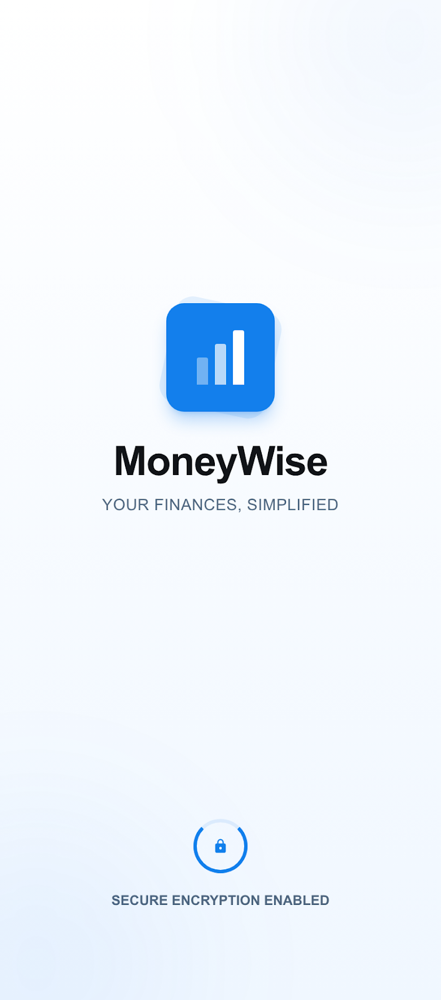
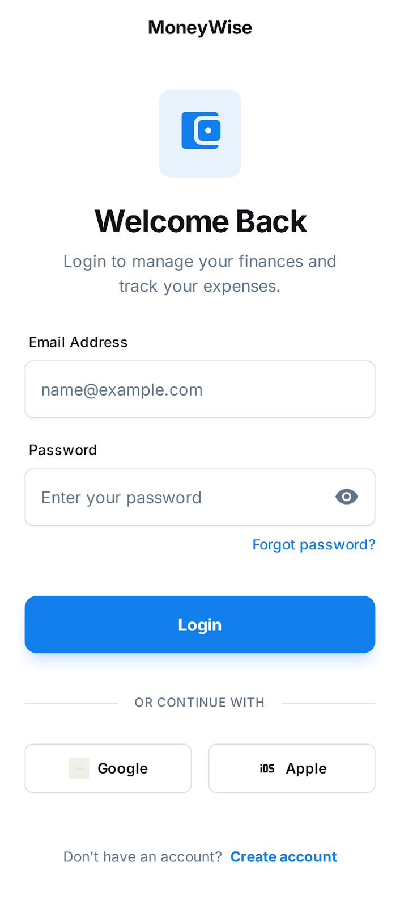
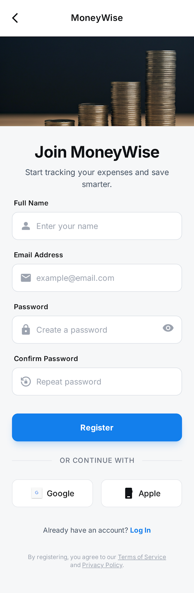
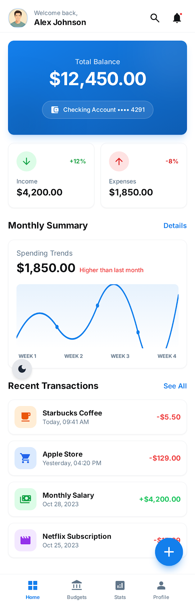
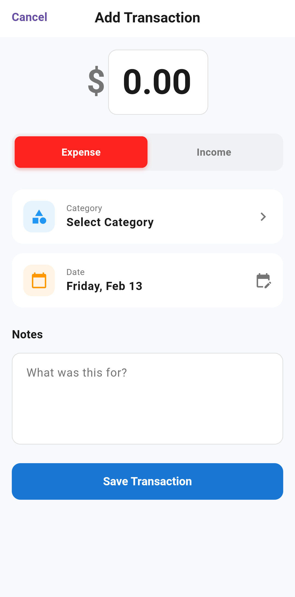
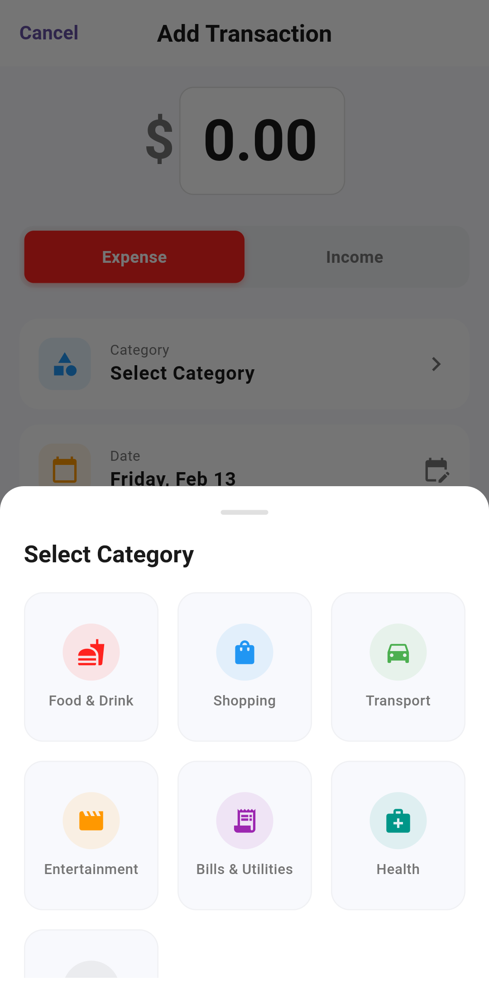
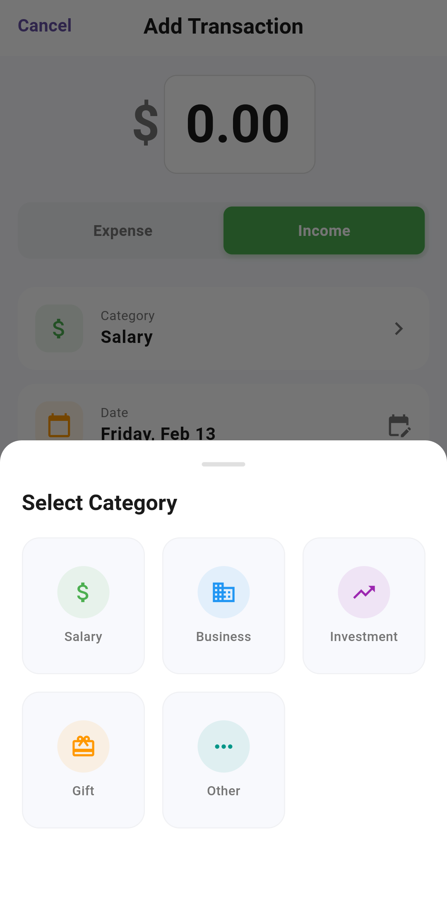
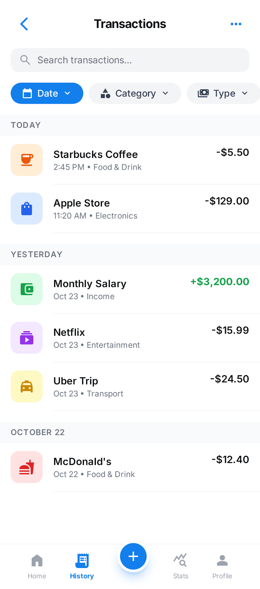
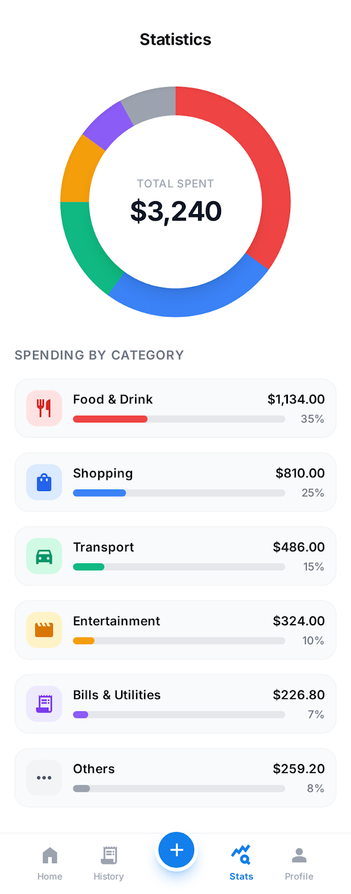

<div align="center">

# 💰 Money Tracker App

  
  
  
  
  

  <br>
  <br>

**Your finances, simplified. A smart expense tracker built with Flutter, Firebase, and Hive.**

<i>Feature-First Architecture • Offline Support • Real-time Sync • Multi-Language • Dark/Light Mode</i>

</div>

---

## 📖 Overview

**MoneyTracker** is a modern financial management tool designed to help users track expenses, monitor income, and visualize spending habits. Built with **Feature-First Architecture**, it leverages **Cubit** for state management, **Firebase** for secure cloud synchronization, and **Hive** for fast local storage and offline capabilities.
To ensure a personalized user experience, the app now features **fully adaptive theming** (Dark & Light modes) and **Localization support**, allowing users to manage their finances in their preferred language and interface style.

---

## 📸 Screenshots

|                          splash                          |                     Authentication                      |                        Registration                        |                         Dashboard                         |
| :------------------------------------------------------: | :-----------------------------------------------------: | :--------------------------------------------------------: | :-------------------------------------------------------: |
|  |  |  |  |

|                      Add Transaction                       |                      Expense Details                      |                      Income Details                      |                             History                             |
| :--------------------------------------------------------: | :-------------------------------------------------------: | :------------------------------------------------------: | :-------------------------------------------------------------: |
|  |  |  |  |

|                       Statistics                        |                     Profile & Settings                      |
| :-----------------------------------------------------: | :---------------------------------------------------------: |
|  |  |

---

## 🎨 Color Palette

The app features a cohesive design system defined in `ColorsManager`.

|                          Color                           |    Hex    | Variable Name  | Usage                       |
| :------------------------------------------------------: | :-------: | :------------- | :-------------------------- |
|  | `#1976D2` | `primaryBlue`  | **Primary Brand / Buttons** |
|  | `#1A1A1A` | `textDark`     | **Headings / Primary Text** |
|  | `#F8F9FD` | `background`   | **App Scaffolding**         |
|  | `#4CAF50` | `successGreen` | **Income / Success**        |
|  | `#FF231F` | `expenseRed`   | **Expenses / Alerts**       |
|  | `#757575` | `textGrey`     | **Subtitles / Hints**       |
|  | `#E0E0E0` | `lightGrey`    | **Borders / Dividers**      |

---

## ✨ Features

**🚀 Robust Tech Stack:**

- **State Management:** `flutter_bloc` (Cubit) for predictable state transitions.
- **Backend:** Firebase Auth for secure login & Cloud Firestore for real-time data.
- **Local Storage:** Hive for caching data and enabling full offline support.

**📱 Key Functionalities:**

- **📊 Smart Dashboard:** View total balance, monthly summary, and spending trends at a glance.
- **📈 Visual Analytics:** Interactive graphs and pie charts to break down spending by category.
- **📝 Transaction Tracking:**
  - Easily add Income or Expenses.
  - Categorize transactions with custom icons.
  - Add notes and select payment methods.
- **🔐 Secure Authentication:** Login via Email, Google, or Apple ID.
- **⚙️ Personalization:** Dark Mode support, currency customization, and secure data sync.
- **🌐 Localization:** Fully localized in English and Arabic.
- **📱 Responsive Design:** Adapted for various screen sizes using custom Media Query extensions.

---

## 📂 Project Structure

This project follows a **Feature-First** architecture to ensure scalability, maintainability and clean dependency management.

````text
lib/
├── core/
│   ├── dataSource/         # Hive & Fire
│   ├── extensions/         # Media Query & Responsive
│   ├── theme/              # ColorsManager & App Theme
│   ├── utils/              # Constants, Strings, & Validators
│   └── localization/       # ar, en
├── feature/
│   ├── splash/             # Initial splash screen & App startup
│   ├── auth/               # Login, Register
│   ├── main_scaffold/      # Bottom Navigation & App Shell
│   ├── home/               # Dashboard
│   ├── stats/              # Statistics & Chart visualizations
│   ├── transactions/       # Transaction History
│   ├── add_transaction/    # Add New Transaction
│   └── profile_settings/   # User Profile, Settings & Localization
└── main.dart


---

## 🚀 Getting Started

Follow these instructions to get a copy of the project up and running on your local machine.

### Installation

1.  **Clone the repository**

    ```bash
    git clone https://github.com/Mohamed-ElTahan/MoneyTracker-App.git
    ```

2.  **Navigate to the project directory**

    ```bash
    cd money_tracker_app
    ```

3.  **Install dependencies**

    ```bash
    flutter pub get
    ```

4.  **Firebase Setup**
    * Ensure you have your `google-services.json` (Android) and `GoogleService-Info.plist` (iOS) placed in their respective folders.

5.  **Run the app**
    ```bash
    flutter run
    ```
````
